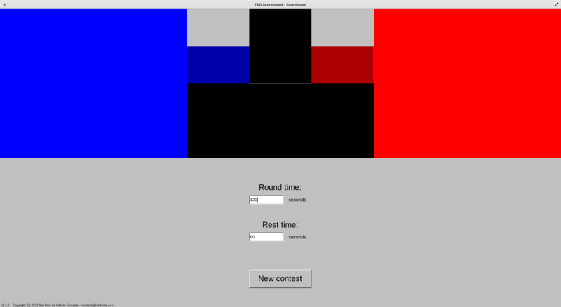
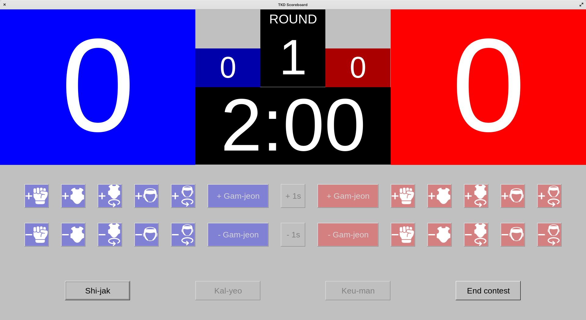
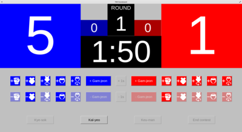
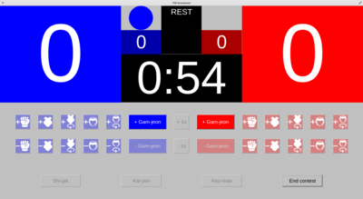
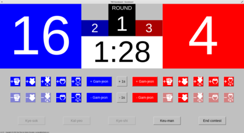
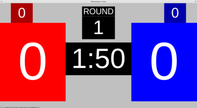
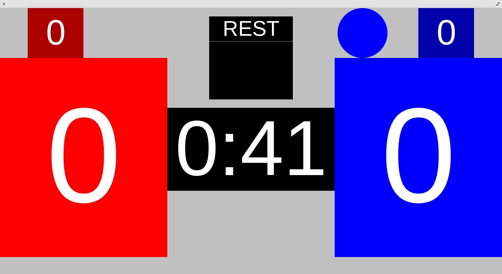
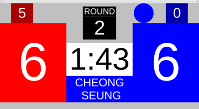

# tkd-scoreboard

[](https://doc.rust-lang.org/edition-guide/rust-2021/index.html)
[](https://github.com/fltk-rs/fltk-rs)

This project aims to provide a simple taekwondo scoreboard program for the best of 3 rounds kyorugi contest system, with the World Taekwondo competition rules in force as of the 1st of September of 2022.

Executables for Windows and Unix-like systems can be downloaded from the [releases section of this repository](https://github.com/irzinfante/tkd-scoreboard/releases).

## Linux desktop entry

To add this program as an app to be launched from apps menu in create the file `tkd-scoreboard.desktop` in `~/.local/share/applications` with the following content:

```
[Desktop Entry]
Type=Application
Name=TKD Scoreboard
Comment=Scoreboard program for taekwondo competition
Icon=tkd-scoreboard
Exec=tkd-scoreboard
Terminal=false
Categories=Game;Utility;
```

Put the Unix-like binary from releases downloads in `~/.local/bin` (remember to modify its permissions to allow execution) and the [icon file](assets/tkd-scoreboard.png) in `~/.icons` to make them available for the desktop entry file.

## Screenshots

|  |
|:--:|
| *On new program execution round time and rest time can be configured for the contest. Selected values remain the same in consecutive contests.* |

| <table><tbody><tr><td style="width:400px"></td><td style="width:400px"></td></tr><tr><td style="width:400px"></td><td style="width:400px"></td></tr></tbody></table> |
|:--:|
| *Different stages of the contest from start to the end of the match.* |

| <table><tbody><tr><td style="width:400px"></td><td style="width:400px"></td></tr><tr><td style="width:400px"></td><td style="width:400px"></td></tr></tbody></table> |
|:--:|
| *Same as previous but from the screen view.* |

## License

Copyright (C) 2022 Iker Ruiz de Infante Gonzalez contact@irzinfante.eu

This program is free software: you can redistribute it and/or modify it under the terms of the GNU General Public License as published by the Free Software Foundation, either version 3 of the License, or (at your option) any later version.

This program is distributed in the hope that it will be useful, but WITHOUT ANY WARRANTY; without even the implied warranty of MERCHANTABILITY or FITNESS FOR A PARTICULAR PURPOSE. See the GNU General Public License for more details.

You should have received a copy of the GNU General Public License along with this program. If not, see <https://www.gnu.org/licenses/>.

[LICENSE](LICENSE) contains a copy of the full GPLv3 licensing conditions.
