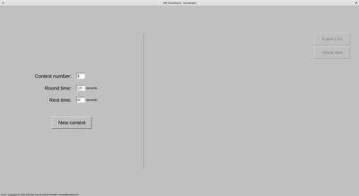
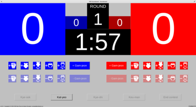
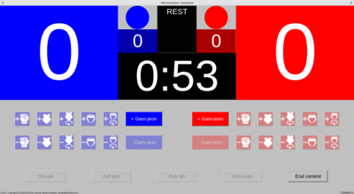
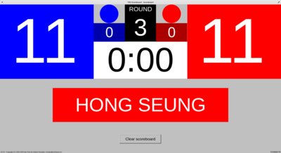

# tkd-scoreboard

[](https://releases.rs/docs/1.73.0/)
[](https://crates.io/crates/fltk)
[](https://crates.io/crates/chrono)
[](https://crates.io/crates/directories)
[](https://crates.io/crates/cacache)

This project aims to provide a simple taekwondo scoreboard program for the best of 3 rounds kyorugi contest system, with the World Taekwondo competition rules in force as of the 1st of September of 2022.

Executables for Windows and GNU/Linux systems can be downloaded from the [releases section of this repository](https://github.com/irzinfante/tkd-scoreboard/releases).

## Linux desktop entry

To add this program as an app to be launched from apps menu in create the file `tkd-scoreboard.desktop` in `~/.local/share/applications` with the following content:

```
[Desktop Entry]
Type=Application
Name=TKD Scoreboard
Comment=Scoreboard program for taekwondo competition
Icon=tkd-scoreboard
Exec=tkd-scoreboard
Terminal=false
Categories=Game;Utility;
```

Put the Unix-like binary from releases downloads in `~/.local/bin` (remember to modify its permissions to allow execution) and the [icon file](assets/tkd-scoreboard.svg) in `~/.icons` to make them available for the desktop entry file.

## Lifecycle flowchart


## Screenshots

|  |
|:--:|
| *Before each contest, contest settings can be configured. Data from already finalized contest can be exported and deleted..* |

| <table><tbody><tr><td style="width:400px"></td><td style="width:400px"></td></tr><tr><td style="width:400px"></td><td style="width:400px"></td></tr><tr><td style="width:400px"></td><td style="width:400px"></td></tr><tr><td style="width:400px"></td><td style="width:400px"></td></tr><tr><td style="width:400px"></td><td style="width:400px"></td></tr></tbody></table> |
|:--:|
| *Different stages of the contest from start to the end of the match.* |

| <table><tbody><tr><td style="width:400px"></td><td style="width:400px"></td></tr><tr><td style="width:400px"></td><td style="width:400px"></td></tr><tr><td style="width:400px"></td><td style="width:400px"></td></tr><tr><td style="width:400px"></td><td style="width:400px"></td></tr><tr><td style="width:400px"></td><td style="width:400px"></td></tr></tbody></table> |
|:--:|
| *Same as previous but from the screen view.* |

## License

Copyright (C) 2022-2024 Iker Ruiz de Infante Gonzalez iker@irzinfante.eu

This program is free software: you can redistribute it and/or modify it under the terms of the GNU General Public License as published by the Free Software Foundation, either version 3 of the License, or (at your option) any later version.

This program is distributed in the hope that it will be useful, but WITHOUT ANY WARRANTY; without even the implied warranty of MERCHANTABILITY or FITNESS FOR A PARTICULAR PURPOSE. See the GNU General Public License for more details.

You should have received a copy of the GNU General Public License along with this program. If not, see <https://www.gnu.org/licenses/>.

[LICENSE](LICENSE) contains a copy of the full GPLv3 licensing conditions.
